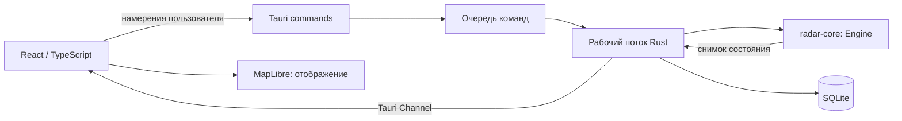
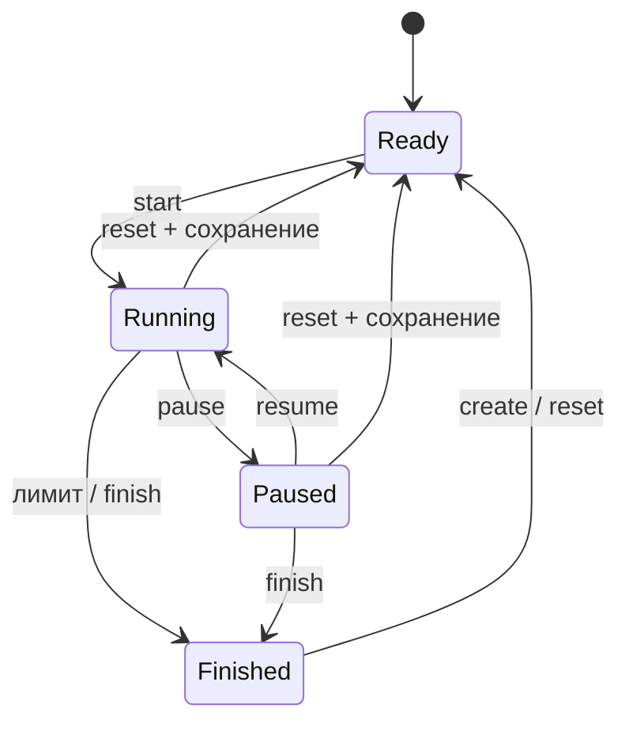

# Архитектура

## Границы ответственности



`radar-core` не знает об IPC, потоке, системном времени или SQLite. Это воспроизводимая модель, которую можно выполнять и тестировать без окна. Истинный тип `Kind` приватен; публичный `TargetView` его не содержит.

Desktop-слой последовательно обрабатывает команды и шаги симуляции в одном потоке. Состояние движка не размазывается по нескольким Mutex. Tauri-команды передают запрос в очередь и ожидают ответ через `spawn_blocking`, не блокируя UI-поток. SQLite принадлежит тому же рабочему потоку. Для 20 объектов и локального приложения этого достаточно; длительные внешние операции в этот поток добавлять не следует.

Прикладной worker получает независимые `Repository` и `IdentityProvider` из `src-tauri/src/ports.rs`. Сейчас оба реализует SQLite `Store` с одной connection; ответы хранилища типизированы, JSON формируется на границе IPC. Настройки и их валидация вынесены в `settings.rs`. План перехода к PostgreSQL/API/SSO и необходимые изменения для сетевого I/O описаны в [SCALABILITY.md](SCALABILITY.md).

React хранит последний подтверждённый снимок, состояние диалогов, настройки визуализации и черновик зон. MapLibre отвечает за географическую проекцию, pan/zoom/rotation, рисование и hit testing. Все решения о правильности отметки, видимости и уведомлениях принимает Rust.

## Организация доменного ядра

`lib.rs` — только публичный фасад и общие константы. Потребители по-прежнему импортируют `radar_core::{Engine, Config, ...}`; внутренние модули приватны.

- `config.rs`: параметры сценария и проверка допустимых значений.
- `geometry.rs`: локальные координаты, перевод в географические и попадание в полигон.
- `zones.rs`: типы зон и стартовая разметка.
- `snapshot.rs`: сериализуемые данные для IPC; скрытый тип цели сюда не попадает.
- `engine/mod.rs`: состояние сеанса, шаг движения, отметки и оценка.
- `engine/generation.rs`: генерация целей в стабильном порядке вызовов PRNG.
- `engine/detection.rs`: видимость, вход в зоны, уведомления.
- `engine/random.rs`: детерминированный генератор случайных чисел.
- `engine/tests.rs`: доменные unit-тесты; `tests/public_contract.rs`: проверки через публичный API.

Разбиение не меняет алгоритмы, публичные типы или JSON-контракт. Настройки, SQLite и Tauri остаются за границей ядра.

## Время и пауза

Движок получает `tick()` с фиксированным шагом 50 мс. `simulationTimeMs` увеличивается только в `Running`. Даты интерфейса берутся из реальных часов Windows, а таймер, времена появления, исчезновения, уведомлений и реакций — из симуляционных часов.



На паузе `tick()` ничего не меняет: координаты, срок жизни целей, PRNG, таймеры, следы, счёт и очередь событий остаются прежними. На паузе `identify` возвращает ошибку. `resume` заново назначает ближайший реальный тик. Период ожидания и сон компьютера не догоняются большим `delta`. При перегрузке симуляция замедляется относительно реального времени, сохраняя численную модель.

Снимки передаются с номинальной частотой 20 Гц без экстраполяции на клиенте. Луч вращается по часовой стрелке от севера с периодом 4 секунды (`SWEEP_PERIOD_MS`, выбранный параметр прототипа). Его `sweepBearing` вычисляет Rust по симуляционному времени. Пересечение проверяется по угловому сектору, пройденному за шаг 50 мс, включая переход через север. Это упрощённая дискретная модель обзора, не электромагнитная модель антенны.

Физические координаты продолжают меняться каждый тик, но UI получает только последнее обнаруженное положение (`observedAtMs` — время измерения). До первого прохода цель отсутствует в DTO; между проходами отметка и её след неподвижны. Уведомления зон и начало отсчёта реакции привязаны к обнаружению лучом. Истинный курс остаётся внутренней частью физики. Отключаемая стрелка направления оценивается в UI по двум последним точкам следа; до второго обнаружения её нет. Настройка выключена по умолчанию и независима от отображения следа. Пауза замораживает также луч. Исчезновение/выход за радиус удаляет отметку; зона игнорирования скрывает её сразу — это сохранённое упрощение прототипа, а не модель затухания потерянных контактов.

При перезагрузке окна повторная подписка переводит активный сеанс на паузу. Ошибка отправки в закрытый канал также приостанавливает модель. Перезапуск процесса не восстанавливает незавершённый сеанс.

## Сохранение и безопасные переходы

- `Create`, `Reset`, `Logout` и `PrepareClose` проверяют сохранение предыдущего результата, в том числе уже завершённого. При ошибке SQLite движок и пользователь остаются в памяти. Повторный `Finish` сохраняет тот же UUID идемпотентно; в результатах есть кнопка повторной записи.
- X и Alt+F4 перехватываются Rust (`CloseRequested`). UI показывает подтверждение; при согласии приостанавливает модель, дожидается PNG и настроек, затем вызывает `close_application`. Rust завершает сеанс, сохраняет его и только после успеха вызывает `app.exit(0)`. При ошибке окно остаётся открытым; тренировка остаётся на паузе либо завершённой, продолжение после отмены — явно кнопкой оператора.
- Общий UI-барьер переходов запрещает новый захват PNG и повторные переходы, отправляет идемпотентную `pauseForTransition`, вызывает `PendingCapture.flush()` и `Preferences.flush()`. Это также устраняет гонку с естественным завершением по таймеру. Снимок не относится к новому сеансу: сначала сохраняются старые байты, потом выполняется Reset/Create/Logout.
- `reserveArchive` удерживает копию события в Rust на время захвата, даже если оно вытеснено из последних 200 уведомлений. `archiveImage` сохраняет PNG только для авторизованного владельца текущего сеанса и зарезервированного события. Ошибка записи сохраняет резерв и байты для повтора; успешная запись освобождает резерв. Неудавшийся рендер отменяет резерв через `cancelArchive`. Смена сеанса и закрытие запрещены Rust, пока резерв занят. Повтор уже записанного PNG идемпотентен.
- `src/persistence.ts` отделяет очереди от React: настройки применяются локально синхронными patch-обновлениями и записываются строго последовательно. Ошибка не откатывает более свежую настройку; перед выходом выполняется повторная запись последнего состояния. Количество параллельных обычных запросов учитывается счётчиком.
- `history` и `archives` принимают `offset`, возвращают `items`, `total`, `offset`, `limit` (100). История дополнительно возвращает `correct`, рассчитанный SQL по всем сеансам пользователя, независимо от страницы.

Очереди не являются аварийным журналом. Принудительное завершение процесса, сбой ОС или перезагрузка WebView во время захвата могут потерять ещё не записанный PNG/настройки. При новой подписке Rust снимает осиротевший резерв захвата. Сохранённые результаты и PNG остаются в SQLite. Автовосстановление незавершённого сеанса после аварии не реализовано.

Звук создаётся/возобновляется непосредственно в пользовательских действиях «Старт», «Продолжить» и «Включить звук». Поэтому после перезагрузки WebView можно продолжить тот же сеанс со звуком; при громкости 0 сигнал не создаётся.

## Контракт IPC

Одна команда `request({command})` принимает discriminated union с полем `type`. Поддерживаются bootstrap, login/logout, create, start/pause/resume/finish/reset, identify, history, настройки, смена пароля, администрирование и архив. Отдельная `subscribe({channel})` устанавливает канал и возвращает текущий снимок.

Каждая команда конкретного сеанса содержит `sessionId`. При создании/reset выдаётся новый UUID; команды предыдущего сеанса отклоняются. Каждый снимок содержит возрастающий `sequence`. Ответ команды тоже содержит снимок, поэтому интерфейс не выдаёт локальную паузу за подтверждённую. Снимки прежнего сеанса и старые sequence игнорируются.

```typescript
type Packet = {
  sessionId: string;
  sequence: number;
  status: 'ready' | 'running' | 'paused' | 'finished';
  simulationTimeMs: number;
  remainingTimeMs: number;
  targets: TargetView[];
  notifications: Notice[];
  statistics: Statistics;
  config: Config;
  saveError: string | null;
};
```

Полный DTO-контракт находится в `src/types.ts`, серверные типы — в `radar-core`. Изменения полей требуют синхронной правки обеих сторон и сборки TypeScript. Генерацию типов из Rust можно добавить при росте контракта. Входные числовые параметры и права доступа проверяются на Rust.

## Цели и геометрия

Локальная система координат: x на восток, y на север, единицы — метры. Центр — учебная РЛС 59,88° N, 30,26° E на реальной OSM-карте Санкт-Петербурга. Для UI используется локальная сферическая аппроксимация на радиусе 7 км; это не геодезический инструмент. Границы и центр UI задаёт `map-region.json`; совпадение с Rust проверяет интеграционный тест. Подложка — локальные MVT-тайлы с ODbL-атрибуцией, подготовка описана в [MAP_DATA.md](MAP_DATA.md).

БВС стартуют на 3,1–6,9 км и летят прямо к центру со скоростью 25–35 м/с. Птицы стартуют на 0,3–6,8 км, летят 2–10 м/с и существуют 5–20 секунд; курс меняется с постоянной угловой составляющей и синусоидальной поправкой. У границы 6,8 км птица плавно направляется обратно к центру, чтобы не исчезнуть раньше срока из-за выхода из области обзора. При любом повороте модуль скорости сохраняется.

Xorshift64 с документированным seed даёт повторяемую последовательность. При том же seed, конфигурации и последовательности команд результат воспроизводим. Свободные места заполняются раз в 750 мс; одновременно до 20 живых объектов. Типы выбираются с вероятностью 50/50, без гарантии их пропорции в каждом коротком сеансе.

Зона игнорирования скрывает цель и подавляет тревоги. Зона обнаружения вызывает событие при входе. Пока цель находится внутри, событие не повторяется; повторный вход создаёт новое. Вне полигонов обнаружения, но в радиусе РЛС, цель видна без тревоги. Граница полигона считается внутренней. Настройка зон применяется к следующему сеансу.

След хранит до 40 обнаруженных положений, пополняется только при проходе луча и рисуется жирной белой линией. Изменение `observedAtMs` запускает короткую пульсацию отметки на клиенте; источником события остаётся Rust, поэтому анимация происходит при каждом измерении, а не по независимому UI-таймеру. При скрытии цели след очищается, чтобы не раскрывать её путь внутри зоны игнорирования. Повторное появление требует нового прохода луча.

## Оценка и хранение

Одинарный щелчок закрепляет локальную карточку цели; повторный снимает её. Можно закрепить несколько карточек одновременно, они следуют за последними обнаруженными положениями. Двойной щелчок означает единственное утверждение «это БВС»: решение и статистика фиксируются сразу, цель помечается красным и удаляется только при следующем пересечении лучом её истинного положения. Истинное БВС даёт правильный ответ, птица — ошибку. Неотмеченное БВС, которое было видно хотя бы один раз, считается пропущенным при исчезновении или завершении. Средняя реакция — время от первого видимого появления до отметки, включая ошибочные ответы; пауза исключена.

В режиме экзамена промежуточные correct/errors/missed скрываются в DTO. При завершении публикуется полная статистика. Запись результата идемпотентна по UUID сеанса.

SQLite хранит пользователей, JSON-снимки завершённых сеансов, настройки и PNG-архив. SQL использует связанные параметры. Роли проверяются в Rust. Пароли хешируются Argon2id с уникальной солью; доступны две предварительно созданные учётные записи. CSP запрещает произвольные сетевые скрипты, а карта не загружает внешние ресурсы.

## Использованные технологии

Tauri 2, Rust stable, Serde, rusqlite / SQLite, Argon2id, UUID; React 19, TypeScript strict, Vite, MapLibre GL JS 6, Lucide, html-to-image. Точные версии закреплены в Cargo.lock и package-lock.json.

Основные справочные источники: [Tauri commands](https://v2.tauri.app/develop/calling-rust/), [Tauri channels](https://v2.tauri.app/develop/calling-frontend/), [MapLibre](https://maplibre.org/maplibre-gl-js/docs/).
